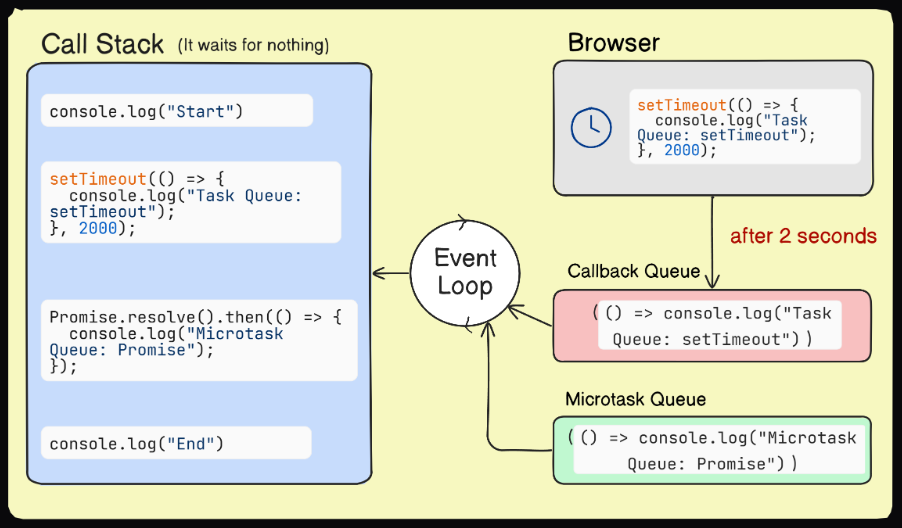

# Understanding the JavaScript Event Loop

In the world of JavaScript, the event loop is what makes asynchronous operations possible without blocking the main thread. It’s the heart of how JavaScript handles multiple tasks at once, keeping web applications smooth and responsive.

If you've ever wondered why JavaScript doesn’t freeze when waiting for a network request or a timer to complete, the event loop is the answer. Understanding this concept is key to writing efficient and performant web applications.

Now, if terms like 'asynchronous' or 'call stack' sound intimidating, don’t worry—I’ll break them down so that anyone, regardless of experience level, can grasp how the event loop works. But before we delve into what that means, let’s first understand how JavaScript works and why we even need the event loop.

## JavaScript Works on a Single Thread

Imagine a single waiter at a restaurant taking orders, serving food, and handling payments. Since there is only one waiter (just like JavaScript is single-threaded), they can only serve one customer at a time. Each order must be taken, prepared, and served before moving on to the next one.

```javascript
console.log("Welcome to the restaurant");

function takeOrder(order1, order2) {
  return `Order placed: ${order1} and ${order2}`;
}

const order = takeOrder("Pasta", "Pizza");
console.log(order);

console.log("Serve the food");
```

**Expected Output:**

```
Welcome to the restaurant
Order placed: Pasta and Pizza
Serve the food
```

### Explanation:

1. The waiter welcomes the customer.
2. The `takeOrder` function is called, and the order is placed immediately.
3. The food is served.

Each step happens in order, just like JavaScript executes code sequentially.

## Handling Delays with Asynchronous Code

Now, what if a dish takes time to cook? Instead of making all customers wait, the waiter moves on to take the next order while the kitchen prepares the dish in the background.

```javascript
console.log("Welcome to the restaurant");

setTimeout(() => {
  console.log("Dish is ready!");
}, 5000);

console.log("Take the next order");
```

**Expected Output:**

```
Welcome to the restaurant
Take the next order
Dish is ready!
```

### Explanation:

1. The waiter welcomes the customer.
2. The dish is sent to the kitchen (`setTimeout` schedules an async task).
3. Instead of waiting, the waiter takes the next order (`Take the next order` logs immediately).
4. Once the dish is ready (after 5 seconds), the waiter serves it (`Dish is ready!`).

## Why Do We Need the Event Loop?

If the waiter stood still waiting for the dish to be ready, the entire restaurant would come to a halt. That’s exactly what would happen in JavaScript without the event loop—long-running operations would freeze everything else.

Instead of waiting 5 seconds and blocking other operations, the event loop allows JavaScript to move on and handle other tasks while waiting for the dish (async operation) to be prepared.

## What is the Event Loop?

The event loop is a process that enables JavaScript to handle asynchronous operations while maintaining a non-blocking environment, even though it runs on a single thread. It continuously checks the call stack and task queues to decide what should be executed next, allowing asynchronous operations like timers, API calls, and user interactions to run without blocking the main thread.

### Call Stack

The call stack is a data structure that keeps track of function calls in JavaScript. It follows the Last In, First Out (LIFO) principle, meaning the last function pushed onto the stack is the first to be executed.

### Web APIs

JavaScript’s runtime environment (browser or Node.js) provides Web APIs, such as:

- `setTimeout()`
- `fetch()`
- DOM Events
- `setInterval()`
- AJAX requests

These APIs allow JavaScript to perform asynchronous operations by handling tasks in the background.

### Task Queue (Callback Queue)

When an asynchronous function like `setTimeout()` completes, its callback is placed in the task queue. These tasks wait for the call stack to be empty before they run.

### Microtask Queue (Higher Priority)

Microtasks like Promises go into a separate microtask queue. These tasks always run before the tasks in the task queue.

## How the Event Loop Works?

```javascript
console.log("Start");

setTimeout(() => {
  console.log("Task Queue: setTimeout");
}, 2);

Promise.resolve().then(() => {
  console.log("Microtask Queue: Promise");
});

console.log("End");
```



### Execution Flow:

1. The JavaScript engine starts executing the script line by line in the Call Stack.
2. "Start" is printed.
3. `setTimeout()` is encountered:
   - The browser sets a 2-second timer and registers the callback function (`() => console.log("Task Queue: setTimeout")`).
   - The function does not execute now; instead, it is placed in the Task Queue to run later.
   - `setTimeout` itself exits, and execution moves forward.
4. `Promise.resolve().then(...)` is encountered:
   - The callback inside `.then()` (`console.log("Microtask Queue: Promise")`) is added to the Microtask Queue.
   - This function will execute after all synchronous code finishes.
5. "End" is printed immediately.
6. Call Stack is now empty. Since all synchronous tasks are done, the Event Loop checks the Microtask Queue first.
7. "Microtask Queue: Promise" is printed from the `.then()` callback.
8. 2 seconds pass, timer expires. The browser moves the `setTimeout` callback function to the Task Queue.
9. Event Loop checks the Call Stack. Since the Call Stack is empty, it takes the `setTimeout` callback from the Task Queue and runs it.
10. Task Queue executes `setTimeout` callback. "Task Queue: setTimeout" is printed.

### Note:

Even though the delay is 0ms, `setTimeout` does not execute immediately; it waits until the Call Stack is empty and after all Microtasks are completed.

If the `setTimeout` delay is 0 milliseconds, the execution flow remains the same because `setTimeout` always places its callback in the Task Queue, which runs after the Microtask Queue. So, even with 0ms, JavaScript first runs all synchronous code, then executes Promises (Microtask Queue), and only after that, it picks up the `setTimeout` callback from the Task Queue. This means the output will still be:

```
Start
End
Microtask Queue: Promise
Task Queue: setTimeout
```

## Task Starvation

Now imagine this, if microtasks keep popping up without allowing other tasks a chance to run, what happens next?

In this scenario, the callback queue won’t get the opportunity to execute its tasks. This is **Starvation of Tasks** in the callback queue.

# JavaScript Execution Process

## Global Context Creation

When a JavaScript program runs, a Global Execution Context (GEC) is created. The execution of a JavaScript program starts in two phases:

### Memory Creation Phase

- Memory is allocated for all variables and functions in the program.
- Variables declared with `var` are initialized with `undefined`, while those declared with `let` and `const` are uninitialized (in the Temporal Dead Zone until their declaration).
- Functions are stored with their entire code block.

### Code Execution Phase

- The code is executed line by line.
- Variables are assigned their values, and functions are invoked when called.
- When a function is invoked, a new execution context within the global context is created, known as the Function Execution Context, which also goes through its own memory creation and code execution phases.

### Example

```javascript
let firstName = "Walter";
let lastName = "White";
let age = 52;

function bioGenerator(firstName, lastName, age) {
  let fullName = firstName + " " + lastName;
  return `${fullName} is ${age} years old.`;
}

let b1 = bioGenerator(firstName, lastName, age);
let b2 = bioGenerator("Peter", "Parker", 21);
```

#### Memory Creation Phase

- Variables `firstName`, `lastName`, `age`, `b1`, and `b2` are in the Temporal Dead Zone (TDZ).
- The entire code of the `bioGenerator` function is stored in memory.

#### Code Execution Phase

- Variables are assigned their values: `firstName: "Walter"`, `lastName: "White"`, `age: 52`, `b1: bioGenerator(...)`, and `b2: bioGenerator(...)`.
- Functions are executed when called, creating a Function Execution Context.

---

## Hoisting

In JavaScript, variables and functions can be accessed before their declaration due to hoisting.

### Example

```javascript
console.log(x); // undefined
var x = 45;

greeting(); // Greeting from function

function greeting() {
  console.log("Greeting from function");
}

console.log(w); // ReferenceError: Cannot access 'w' before initialization
let w = 23;
```

### Key Points

- `var` variables are hoisted and initialized with `undefined`.
- Functions are hoisted with their full code block.
- `let` and `const` variables are hoisted but cannot be accessed before declaration (in TDZ).

---

## Call Stack

The call stack is a data structure used by JavaScript to manage the execution of code. It follows the Last In, First Out (LIFO) principle.

### Example

```javascript
console.log("Start");

setTimeout(() => {
  console.log("This is setTimeout");
}, 0);

console.log("End");
```

#### Output

```
Start
End
This is setTimeout
```

### Step-by-Step Breakdown

1. A GEC is created and pushed into the Call Stack.
2. `console.log("Start")` is executed, logging "Start".
3. `setTimeout` is sent to the Web APIs, and its callback is placed in the Task Queue.
4. `console.log("End")` is executed, logging "End".
5. The Event Loop pushes the callback from the Task Queue to the Call Stack, where it is executed.

---

## Promises and Microtask Queue

Promises are placed in the Microtask Queue, which has higher priority than the Task Queue.

### Example

```javascript
console.log("Start");

setTimeout(() => {
  console.log("This is setTimeout");
}, 0);

Promise.resolve().then(() => {
  console.log("This is Promise");
});

console.log("End");
```

#### Output

```
Start
End
This is Promise
This is setTimeout
```

---

## Starvation

Starvation occurs when tasks in the Task Queue are delayed indefinitely because the Microtask Queue is continuously filled with new tasks.

---
