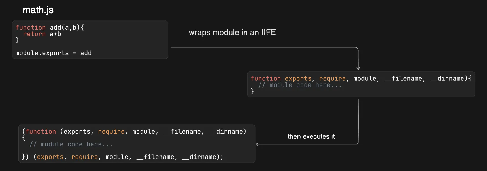
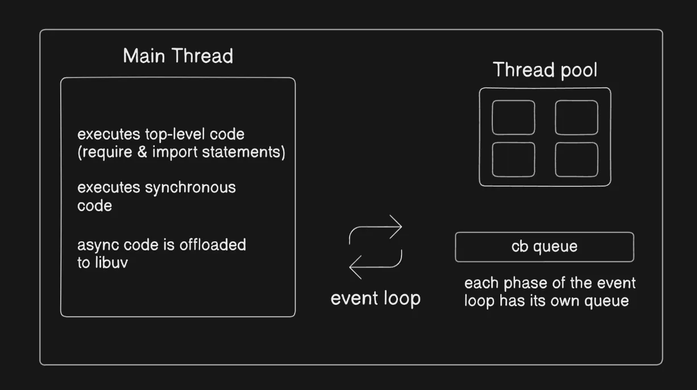
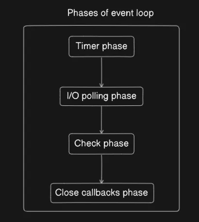

# NodeJS

# **What is Node.js?**

Node.js is a **JavaScript runtime environment** built on Chrome’s **V8 engine**. It was developed by **Ryan Dahl in 2008** to allow JavaScript to run outside the browser, making it ideal for **server-side development** and **building scalable applications**.

V8 Engine → Open-Source JS engine by Chromium.

### **Why Node.js?**

✔ **Capable of asynchronous I/O & event-driven architecture**

✔ **High performance**

✔ **Cross-platform**

✔ **Rich package ecosystem (npm)**

<aside>
💡

Ryan Dahl initially experimented with **SpiderMonkey** (Mozilla’s JavaScript engine) but later switched to **V8** due to its **superior performance and efficiency**.

</aside>

## **Other JavaScript Runtime Environments**

While Node.js is the most widely used runtime, newer alternatives have emerged, offering improvements in performance, security, and ease of use.

### **Deno**

- **Created by Ryan Dahl** (as a Node.js successor).
- Built on **V8** but written in **Rust**, making it more secure and memory-efficient.
- **Supports TypeScript natively.**
- Uses **ES modules** instead of CommonJS.

### **Bun**

- **Created by Jarred Sumner**, optimized for speed.
- Uses **JavaScript Core** (instead of V8), making it **lighter and faster**.
- Comes with a **built-in bundler, transpiler, and test runner**.
- Designed as a **drop-in replacement for Node.js**, meaning most Node.js projects can switch to Bun **with minimal changes**.
- Aims for **nearly 100% Node.js compatibility**.

<aside>
💡

**Deno was named after an anagram of Node.**

</aside>

---

# **Importing Modules in Node.js**

Node.js supports two module systems:

- **CommonJS (`require`)** → Older way of importing modules.
- **ES Modules (`import`)** → Modern way of importing modules.

## **CommonJS**

In CommonJS, modules are loaded **dynamically at runtime**

- **Importing a Module**
    - 📝 **Code** **Example**
        
        **math.js**
        
        ```jsx
        console.log("Executing math module");
        
        // math module code...
        
        console.log("Finished executing math module");
        ```
        
        **index.js**
        
        ```jsx
        require("./math.js");
        console.log("Hello world")
        ```
        
        **Output**
        
        ```
        Executing math module
        Finished executing math module
        Hello world
        ```
        
- **Exporting and Importing Functions**
    - 📝 **Code** **Example**
        
        **📌 math.js**
        
        ```jsx
        function add(a, b) {
          return a + b;
        }
        
        module.exports = add;
        ```
        
        **📌index.js**
        
        ```jsx
        const add = require("./math.js");
        
        const result = add(4, 3);
        console.log(result); // Output : 7
        ```
        

**So, requiring a module executes its code and returns the** `module.exports` **object.**

### **How `require()` Works Internally?**

When you use `require('module-name')`, Node.js follows these steps:

1. **Resolve the module path** → Checks if the module is:
    - A **built-in core module** (like `fs` or `http`)
    - A file (`./module.js`)
    - Inside `node_modules` (third-party packages)
2. **Load the module** → Reads the module’s file content using`fs.readFileSync()` .
3. **Execute the module** → Wraps it in an **Immediately Invoked Function Expression (IIFE)** that ensures modularity and isolates variables from the global scope.
4. **Cache the module** → Stores the module in memory to avoid reloading multiple times.
5. **Return `module.exports`**  →  Provides access to the exported content.



### **Parameters in the Wrapper Function**

| Parameter | Description |
| --- | --- |
| **`exports`** | Alias for `module.exports` |
| **`require`** | Function to import modules |
| **`module`** | Represents the current module |
| **`__filename`** | Absolute path of the current module file |
| **`__dirname`** | Absolute path of the directory containing the current module |
- **📝 Code Example**
    
    Both `exports` and `module.exports` initially point to the **same** object.
    So, you can add properties to `exports`, and they will be reflected in `module.exports`.
    
    ```jsx
    let counter = 0;
    function increment() {
      counter++;
    }
    
    exports.counter = counter;
    module.exports.increment = increment;
    
    console.log(exports === module.exports);
    ```
    
    ****However, if you reassign `exports` directly, it **breaks the reference** to `module.exports`.
    
    ```jsx
    let counter = 0;
    function increment() {
      counter++;
    }
    
    exports = counter;
    module.exports = increment;
    
    console.log(exports === module.exports);
    ```
    

---

## **ES Modules (ESM)**

- When the JavaScript engine encounters an `import` statement, it does not execute it immediately.
- Instead, it **parses** the module before execution, resolving all `import` and `export` statements at compile time.
- Module fetching is **asynchronous** (doesn't block parsing)
- Execution of the **script is blocked until the imports are resolved**.
- Once a module is resolved, its execution is synchronous.
- **📝 Code Example**
    
    **counter.js**
    
    ```jsx
    console.log("Executing counter.js");
    
    let counter = 0;
    function increment() {
      count++;
    }
    module.exports = { counter, increment };
    
    console.log("Finished executing counter.js");
    ```
    
    **index.js**
    
    ```jsx
    console.log("Value of counter :", counter);
    import { add, counter } from "./counter.js";
    
    console.log("Calling increment")
    increment()
    ```
    
    **Output**
    
    ```
    Executing math.js
    Finished executing math.js
    Calling increment
    ```
    
    **Execution flow**
    
    - ESM modules are loaded asynchronously, but execution of execution of `index.js` is paused until `counter.js` is resolved.
    - Once `counter.js` is loaded, its execution is synchronous.
    - Only after `counter.js` is done, `index.js` continues execution.

---

## **CommonJS vs ES Modules**

| Feature | CommonJS  | ESM |
| --- | --- | --- |
| **Default in Node.js** | Yes | No (must enable) |
| **Execution Mode** | Non-strict mode | Strict mode |
| **Synchronous Execution** | Yes | No (Async loading) |
| **Live Bindings** | No | Yes |
| **Tree Shaking** | No | Yes |
| **Browser Support** | No (Needs bundler) | Yes (Native) |

<aside>
💡

**Tree Shaking**: A process that removes unused code from a final JavaScript bundle, improving performance. ESM supports tree shaking because it uses static imports.

**Live Bindings**: In ESM, when a module updates a variable, other modules importing it also see the updated value in real time. CommonJS doesn’t have this feature since it exports values as copies.

- **📝 Code Example**
    - **CommonJS**
        
        **counter.js**
        
        ```jsx
        let counter = 0;
        function increment() {
          counter++;
        }
        module.exports = { counter, increment };
        ```
        
        **index.js**
        
        ```jsx
        const { increment, counter } = require("./counter");
        
        console.log(counter); // 0
        increment();
        console.log(counter); // 0 (does NOT update because it's a copy)
        ```
        
    - **ES Modules**
        
        **counter.js**
        
        ```jsx
        export let counter = 0;
        export function increment() {
          counter++;
        }
        ```
        
        **index.js**
        
        ```jsx
        import { counter, increment } from "./counter.js";
        
        console.log(counter); // 0
        increment();
        console.log(counter); // 1 (updated because of live binding)
        ```
        
</aside>

---

## **Named vs Default Exports**

### **CommonJS**

- **Default Export** (Only one per file)
    
    ```jsx
    module.exports = greet;
    ```
    
- **Named Exports** (Multiple exports possible)
    
    ```jsx
    module.exports = { counter, increment };
    ```
    
- **Alternative Named Export Syntax**
    
    ```jsx
    module.exports.counter = counter;
    exports.increment = increment
    ```
    

### **ES Modules**

- **Default Export**
    
    ```jsx
    export default function greet() {
        return "Hello!";
    }
    ```
    
- **Named Exports**
    
    ```jsx
    export let counter = 0;
    function increment() {
      counter++;
    }
    
    export { increment };
    ```
    

---

# How Node.js handles async operations?

- Whenever an **async task** (I/O, timers, promises, etc.) is encountered, it is **offloaded to libuv**.
- **Libuv** is a C++ library that Node.js uses to handle asynchronous I/O operations and manage the event loop.
- The **event loop** continuously checks for completed async tasks and moves them to the callback queue.
- **Libuv** provides a **thread pool** for executing non-blocking tasks like file system operations, DNS resolution, and cryptography.
- If a task requires **file system access, network calls, or crypto operations**, **libuv’s thread pool** handles it asynchronously.
    
    
    

## Phases of Event Loop

1. **Timers Phase** → Executes callbacks from `setTimeout` and `setInterval`
2. **I/O Polling Phase** → Executes I/O-related callbacks
3. **Check Phase** → Executes `setImmediate` callbacks
4. **Close Callbacks Phase** → Executes close event callbacks (e.g. `socket.on('close')`)



<aside>
💡

**Before each phase of event loop, microtasks (process.nextTick and Promises) are processed first.**

</aside>

- **Internals**
    
    ## In reality there are 6 phases in event loop
    
    1. **Timers Phase** → Executes callbacks from `setTimeout` and `setInterval`.
    2. **I/O Callbacks Phase** → Executes I/O-related callbacks (excluding close handlers, timers, and `setImmediate`).
    3. **Idle, Prepare Phase** (internal) → Used internally by Node.js for system-level tasks.
    4. **Poll Phase** → Processes I/O events, fetching new I/O events if none are pending.
    5. **Check Phase** → Executes `setImmediate()` callbacks.
    6. **Close Callbacks Phase** → Executes close event callbacks (e.g., `socket.on('close')`).
    
    ---
    
    ## **Timers Phase**
    
    This phase handles the execution of expired timers created using `setTimeout()` and `setInterval()`.
    
    ### **How Timers Work Internally**
    
    - **Timer Creation**: When `setTimeout()` is called, the timer is added to the **timers heap** (a min-heap sorted by expiration time).
    - **Event Loop Execution**:
        - On each iteration, Node.js checks the **timers heap** for expired timers.
        - If a timer has expired, its **callback** is moved to the **callback queue**.
        - The event loop executes the callback when the **call stack** is empty.
    - **Clearing Timers**: Calling `clearTimeout()` removes the timer from the heap, preventing execution.
    - **📝 Code Example**
        
        ```jsx
        const timer = setTimeout(() => {
          console.log("Hello there!");
        }, 1000);
        
        clearTimeout(timer); // Cancels the timer before execution
        ```
        
    
    ### **Timer Object Internals**
    
    `setTimeout` and `setInterval` return a **timer object**, an instance of the `Timeout` class from Node.js's **Timers module**.
    
    This object wraps the internal mechanism Node uses to manage asynchronous timers.
    
    - **📝 Code Example**
        
        ```jsx
        Timeout {
          _idleTimeout: 1000,
          _idlePrev: [TimersList],
          _idleNext: [TimersList],
          _idleStart: 44,
          _onTimeout: [Function (anonymous)],
          _timerArgs: undefined,
          _repeat: null,
          _destroyed: false,
          [Symbol(refed)]: true,
          [Symbol(kHasPrimitive)]: false,
          [Symbol(asyncId)]: 2,
          [Symbol(triggerId)]: 1,
          [Symbol(kAsyncContextFrame)]: undefined
        }
        ```
        
    
    ---
    
    ## **I/O Callbacks Phase**
    
    - Executes **leftover I/O callbacks** that were **deferred from previous event loop cycles**.
    - These callbacks include **errors from network requests, DNS lookups, and other low-level I/O system operations**.
    
    **Deferred Execution Scenarios:**
    
    - A task **may be deferred from the Poll Phase to the next event loop cycle’s I/O Callbacks Phase** if:
        1. The **Poll Phase runs out of time** (i.e. it has exceeded its allowed processing time).
        2. The **I/O callback is scheduled asynchronously** (e.g., network operations like TCP, DNS, or sockets).
    
    ---
    
    ## **Idle, Prepare Phase**
    
    - **Used internally by Node.js** to prepare for the next cycle.
    - No direct access for developers.
    
    ---
    
    ## **Poll Phase**
    
    - Executes **newly completed I/O events** **if available**.
    - If no timers are waiting, and no `setImmediate()` callbacks exist, the event loop **enters an idle state** and waits for new I/O events
    - **Most file I/O operations complete in the same Poll phase**
    - **Network-based I/O (TCP, sockets) can be deferred next cycle’s I/O Callbacks phase** if the Poll phase has too many tasks.
    - **📝 Code Example**
        
        ```java
        const fs = require("fs");
        
        setTimeout(() => {
          console.log("Executing timeout");
        }, 0);
        
        fs.readFile("data.txt", "utf8", (err, data) => {
          setImmediate(() => {
            console.log("File reading completed");
          });
        });
        ```
        
        In most cases, **`setTimeout` executes first** because **Timers phase comes before the I/O phase**.
        However, if the file read is **extremely fast** (due to caching, SSDs, or an empty file), it **might** finish before `setTimeout` is picked up in the event loop, leading to the opposite order.
        
    - **Why does `this` refer to `ReadFileContext` when the file is missing?**
        
        ```jsx
        const fs = require("fs");
        
        fs.readFile("./sample.txt", "utf-8", function () {
          console.log(this);
        });
        ```
        
        **Output**
        
        ```jsx
        ReadFileContext {
          fd: undefined,
          isUserFd: false,
          size: 0,
          callback: [Function (anonymous)],
          buffers: null,
          buffer: null,
          pos: 0,
          encoding: 'utf-8',
          err: null,
          signal: undefined
        }
        ```
        
        - The `fs.readFile` function internally creates a **ReadFileContext** object before attempting to open the file.
        - When the file does not exist, an error occurs **before** the operation is fully handed over to the event loop.
        - At the moment when the callback executes, `this` still refers to the `ReadFileContext` object because the read operation didn't reach the phase where it would fully detach from its internal context.
        - When the file exists, `fs.readFile` completes successfully and the callback is invoked **as part of the event loop**.
        - By the time the callback executes, it is running in the broader Node.js execution context, where `this` is set to `global` (or `undefined` in strict mode).
    
    ---
    
    ## **Check Phase (`setImmediate`)**
    
    - Executes **callbacks scheduled with `setImmediate()`**
    - **📝 Code Example**
        
        ```java
        const fs = require("fs");
        
        fs.readFile("sample.txt", "utf8", (err, data) => {
          console.log("File reading completed");
          setTimeout(() => {
            console.log("executing timeout");
          }, 0);
          setImmediate(() => {
            console.log("executing immediate");
          });
        });
        ```
        
    
    <aside>
    💡
    
    **If no synchronous code exists**, the order between `setImmediate()` and `setTimeout(0)` is unpredictable.
    
    - **📝 Code Example**
        
        ```jsx
        setImmediate(() => {
          console.log("immediate fn");
        });
        
        setTimeout(() => {
          console.log("time out fn");
        }, 0);
        ```
        
        ### **Execution Order**
        
        1. **Event loop starts** (No synchronous code to execute)
        2. No **microtasks** (since we haven’t added any `process.nextTick()` or Promises).
        3. The event loop **might** enter the **Check phase first**, leading to:
            
            ```
            immediate fn
            time out fn
            ```
            
            - However, if the event loop first enters the **Timers phase**, the order could reverse.
            - This behavior is **unpredictable** because there is **no synchronous code** forcing an immediate transition into the Timers phase.
    </aside>
    
    ---
    
    ## **Close Callbacks Phase**
    
    - Executes **close event callbacks**, such as:
        - `socket.on("close", callback)`
        - `stream.on("close", callback)`
    - Handles cleanup events for closed connections.
    
    ---
    
    ## **Microtasks (`process.nextTick` & Promises)**
    
    - **Microtasks always run before the next phase begins**.
    - `process.nextTick` has **higher priority than Promises**.
    - **Order of execution**:
        1. Current phase completes.
        2. All pending **microtasks** execute.
        3. The event loop moves to the next phase.
    - **📝 Code Example**
        
        ```java
        setTimeout(() => console.log("Timers Phase"), 0);
        setImmediate(() => console.log("Check Phase"));
        
        Promise.resolve().then(() => console.log("Microtask (Promise)"));
        process.nextTick(() => console.log("Microtask (nextTick)"));
        ```
        

## Thread Pool

- **Node.js is single-threaded** but uses a **thread pool (managed by libuv)** to handle **CPU-intensive and asynchronous tasks.**
- The thread pool is used for tasks such as:
    - **File System Operations** → `fs.readFile()`, `fs.writeFile()`, etc.
    - **Cryptography** → `crypto.pbkdf2()`, `crypto.scrypt()`, `crypto.randomBytes()`.
    - **Compression** → `zlib.gzip()`, `zlib.deflate()`.
    - **DNS Lookups** → `dns.lookup()` *(not `dns.resolve()`, which uses a network request instead of the thread pool)*.
    - **Async Hooks** → Some internal Node.js APIs rely on the thread pool.
- **📝 Code Example**
    
    ```jsx
    const crypto = require("crypto");
    
    console.log("Start hashing");
    const start = Date.now();
    crypto.pbkdf2("password", "salt", 100000, 1024, "sha512", () => {
      console.log(`[${Date.now() - start}ms] : Password hash 1`);
    });
    crypto.pbkdf2("password", "salt", 100000, 1024, "sha512", () => {
      console.log(`[${Date.now() - start}ms] : Password hash 2`);
    });
    crypto.pbkdf2("password", "salt", 100000, 1024, "sha512", () => {
      console.log(`[${Date.now() - start}ms] : Password hash 3`);
    });
    crypto.pbkdf2("password", "salt", 100000, 1024, "sha512", () => {
      console.log(`[${Date.now() - start}ms] : Password hash 4`);
    });
    crypto.pbkdf2("password", "salt", 100000, 1024, "sha512", () => {
      console.log(`[${Date.now() - start}ms] : Password hash 5`);
    });
    
    console.log("End");
    
    ```
    
- Default size is **4 threads**, but it can be **controlled** by the `UV_THREADPOOL_SIZE` environment variable
- **📝 Code Example**
    
    ```jsx
    const crypto = require("crypto");
    
    process.env.UV_THREADPOOL_SIZE = 2;
    
    const start = Date.now();
    crypto.pbkdf2("password", "salt", 100000, 1024, "sha512", () => {
      console.log(`[${Date.now() - start}ms] : Password hash 1`);
    });
    crypto.pbkdf2("password", "salt", 100000, 1024, "sha512", () => {
      console.log(`[${Date.now() - start}ms] : Password hash 2`);
    });
    crypto.pbkdf2("password", "salt", 100000, 1024, "sha512", () => {
      console.log(`[${Date.now() - start}ms] : Password hash 3`);
    });
    crypto.pbkdf2("password", "salt", 100000, 1024, "sha512", () => {
      console.log(`[${Date.now() - start}ms] : Password hash 4`);
    });
    crypto.pbkdf2("password", "salt", 100000, 1024, "sha512", () => {
      console.log(`[${Date.now() - start}ms] : Password hash 5`);
    });
    
    ```
    
    To optimize performance, it's recommended to set `UV_THREADPOOL_SIZE` equal to the number of logical CPU cores.
    
    ```jsx
    const os = require("os");
    
    process.env.UV_THREADPOOL_SIZE = os.cpus().length;
    
    console.log(process.env.UV_THREADPOOL_SIZE);
    ```
    
    Setting `UV_THREADPOOL_SIZE` higher than the number of logical cores may cause **diminished returns** due to increased context switching.