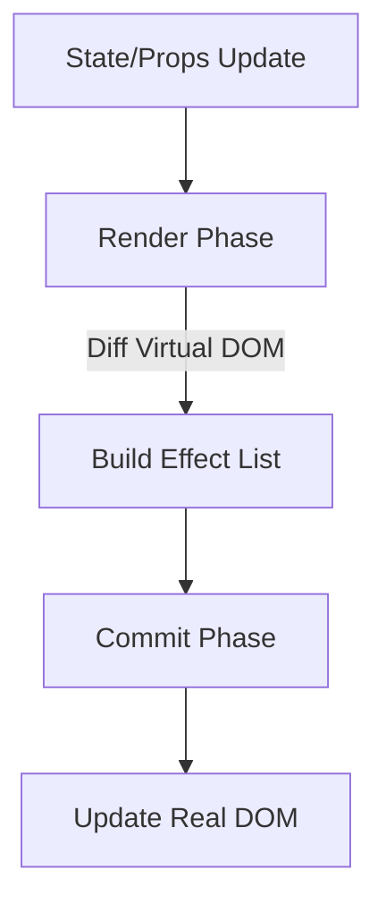

# React Fiber Architecture — Beginner to Advanced Guide

## Introduction

**React Fiber** is a complete reimplementation of React's reconciliation algorithm. It’s designed to improve responsiveness, especially in scenarios involving animations, gestures, or complex UI updates.

The key idea behind Fiber is **incremental rendering** — the ability to split rendering work into smaller units, prioritize them, and spread them across multiple frames. This prevents blocking the main thread and keeps applications smooth.

---

## 1. What is Reconciliation?

**Reconciliation** is the process React uses to figure out what has changed in a UI when state or props are updated.

- Every time state changes (`setState`, `useState`, etc.), React **conceptually re-renders the entire app**.
- Instead of updating everything, React **diffs the new tree with the old one** and updates only what changed.
- This diffing process is **Reconciliation**.

### Example

```jsx
function App() {
  const [count, setCount] = React.useState(0);

  return (
    <div>
      <h1>{count}</h1>
      <button onClick={() => setCount(count + 1)}>Increment</button>
    </div>
  );
}
```

1. Initial render: `<h1>0</h1>`  
2. User clicks Increment → state changes → new tree has `<h1>1</h1>`  
3. React **diffs** old vs new → only `<h1>` changes, not `<button>`  
4. React updates the DOM efficiently.

---

## 2. Reconciliation vs Rendering

- **Reconciliation** = figuring out what changed.  
- **Rendering** = applying those changes to the UI (e.g., updating the DOM or drawing to a native view in React Native).  

Because React separates these phases:
- React DOM and React Native share the **same reconciler**.  
- They only differ in how they render (commit) updates.

---

## 3. Scheduling

**Scheduling** decides *when* React should perform work.

### Why scheduling?
- Not all updates are equally urgent.
- Example:
  - Animation frame update → must run at **high priority**.
  - Background data fetch → can wait.

### Old Model
- React processed updates synchronously → big updates blocked everything.  

### Fiber Model
- React can **pause, resume, or drop work**.
- React assigns **priority levels** to updates.

---

## 4. What is a Fiber?

A **fiber** is a **unit of work** in React Fiber.  

Think of Fiber as:
- A **virtual stack frame** that React can pause, reuse, or discard.
- A **JavaScript object** storing info about a component:
  - Type (function, class, host DOM node, etc.)
  - Key
  - Child / Sibling / Parent
  - Props (pending and memoized)
  - Priority
  - Alternate (link to old fiber)
  - Effect (side effects like DOM updates, lifecycle methods)

### Why Fiber?
- JavaScript call stack is not interruptible.
- Fiber re-implements the stack for React → allowing **interruptible, prioritized work**.

---

## 5. Structure of a Fiber

Each Fiber node has key fields:

- **type & key** → identify what component it represents.
- **child & sibling** → define the tree structure.
- **return** → pointer to parent.
- **pendingProps & memoizedProps** → old vs new props.
- **pendingWorkPriority** → priority level of this work.
- **alternate** → pointer to previous Fiber for diffing.
- **output** → what needs to be rendered (e.g., DOM instructions).

---

## 6. Fiber Tree Example

```jsx
function Parent() {
  return (
    <div>
      <Child1 />
      <Child2 />
    </div>
  );
}
```

Fiber tree:

- `Parent` Fiber
  - Child: `div` Fiber
    - Child: `Child1` Fiber
    - Sibling: `Child2` Fiber

---

## 7. Render and Commit Phases

React Fiber splits rendering into two phases:

### 7.1 Render Phase (Reconciliation)
- Work is broken into units (Fibers).
- React can pause/resume/abort work.
- Builds an **effect list** (what needs updating).

### 7.2 Commit Phase
- Always synchronous.
- Applies changes to the real DOM.
- Runs lifecycle hooks (`componentDidMount`, `useEffect`).

---

## 8. Example with Fiber Execution

```jsx
function Counter() {
  const [count, setCount] = React.useState(0);

  return <h1>{count}</h1>;
}
```

1. Initial render → Fiber for `Counter`, output `<h1>0</h1>`.  
2. `setCount(1)` called.  
3. Render Phase:
   - New Fiber tree created.
   - Diff old vs new (`<h1>0</h1>` → `<h1>1</h1>`).  
4. Commit Phase:
   - Updates DOM: `<h1>` innerText → `1`.

---

## 9. Advanced: Priority Levels in Fiber

React Fiber uses different priority levels:

- **Immediate** → User input, animations.  
- **User-blocking** → Small delays acceptable.  
- **Normal** → Network requests.  
- **Low** → Prefetching.  
- **Offscreen** → Content not yet visible.  

Example:
- Typing in input = high priority.
- Fetching suggestions = lower priority.

---

## 10. Visualization (Mermaid Diagram)



---

## 11. Key Benefits of Fiber

- **Responsive UIs** (no blocking).  
- **Concurrency** (future React concurrent features).  
- **Smarter scheduling**.  
- **Better error handling** (error boundaries).  

---

## 12. Summary

- **Reconciliation** = diffing old vs new virtual DOM.  
- **Fiber** = new architecture enabling interruptible, prioritized updates.  
- **Render Phase** = prepare changes.  
- **Commit Phase** = apply changes.  
- Fiber makes React apps more **efficient, smooth, and scalable**.  
